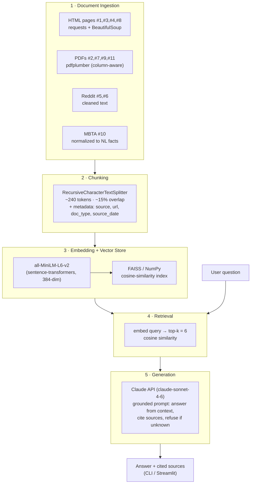

# Project 1 Planning: The Unofficial Guide

> Write this document before you write any pipeline code.
> Your spec and architecture diagram are what you'll use to direct AI tools (Claude, Copilot, etc.) to generate your implementation — the more specific they are, the more useful the generated code will be.
> Update the Retrieval Approach and Chunking Strategy sections if you change your approach during implementation.
> Update this file before starting any stretch features.

---

## Domain

The domain I chose is "Student Housing".
The student housing domain for Northeastern University encompasses complex leasing rules, international student requirements, and localized Boston zoning laws. This knowledge is highly fragmented across official university PDFs, strict legal state documents, and informal crowd-sourced student forums, making it difficult for students to find definitive, synthesized answers when navigating the off-campus housing market.

---

## Documents

<!-- List your specific sources: URLs, subreddit names, forum threads, or file descriptions.
     Aim for at least 10 sources that together cover different subtopics or perspectives within your domain. -->

| # | Source | Description | URL or location |
|---|--------|-------------|-----------------|
| 1 | Northeastern Off-Campus Housing Guidelines | This is the official university portal. Scraping it gives the RAG knowledge of the university's recommended search process, verified property lister guidelines, and "Lease Genius" checklist tools. | https://offcampus.housing.northeastern.edu/explore-housing-options/bostonareahousing/ |
| 2 | Northeastern Guide to Residence Hall Living (PDF) | This is the definitive rulebook for on-campus living. It holds the exact administrative answers to lockout fees, guest policies, move-out dates, and RA protocols. | https://housing.northeastern.edu/wp-content/uploads/2025/08/Guide-to-Residence-Hall-Living-AY25-26-Final.pdf |
| 3 | Office of Global Services (OGS) Housing Guide | Essential for the international demographic. It outlines summer storage options, temporary housing recommendations upon arrival, and scam avoidance specifically tailored to students arriving from abroad. | https://international.northeastern.edu/ogs/housing/ |
| 4 | Network Housing Relocation - International Resources | Details the documentation required for renting without a U.S. credit score, including how to use an I-20 form in place of standard financial documents to secure an off-campus apartment. | https://network.housing.northeastern.edu/relocation-resources/resources-for-international-students/ |
| 5 | r/NEU Housing & Roommate Megathread | Unstructured community data. It captures student sentiment, current market pricing for sublets, warnings about specific management companies, and real-world advice on dorm lotteries. | https://www.reddit.com/r/NEU/ |
| 6 | r/boston Housing Wiki | A massive, crowd-sourced guide to the Boston rental market. It provides neighborhood breakdowns, broker fee avoidance strategies, and standard moving logistics. | https://www.reddit.com/r/boston/wiki/housing/ |
| 7 | Massachusetts Attorney General's Guide to Landlord and Tenant Rights (PDF) | Grounds your RAG in state law. It contains the legal facts regarding security deposit limits, eviction notices, and habitability requirements (heating season rules, pest control). | https://www.mass.gov/doc/2025-guide-to-landlord-tenant-rights-11182025/download |
| 8 | Northeastern Leasing Information & Boston Zoning Rules | Details the "No More Than Four" rule a strict City of Boston zoning ordinance prohibiting more than four unrelated undergraduate students from living together. | https://offcampus.housing.northeastern.edu/get-started/leasing-information/ |
| 9 | Standard Greater Boston Real Estate Board (GBREB) Lease (PDF) | Processing a blank standard lease template allows your system to understand what a standard clause looks like when a user asks about normal landlord fees. | https://freeforms.com/wp-content/uploads/2021/04/Greater-Boston-Real-Estate-Board-Standard-Form-Apartment-Lease.pdf |
| 10 | MBTA Subway Map and Schedules | Commute time is a major factor for off-campus students. Indexing transit data allows the RAG to answer queries about which neighborhoods are directly connected to the main campus. | https://www.mbta.com/schedules/subway |
| 11 | Northeastern International Student Apartment Guide (PDF) | An official NEU brochure aimed at international students. It condenses lease literacy (common lease terms like "jointly and severally," co-signer/guarantor, security deposit rules), a step-by-step scam-avoidance checklist, and a glossary of rental key terms — reinforcing the international demographic alongside sources #3 and #4. | https://international.northeastern.edu/ogs/housing/ (NEU OGS brochure, manually downloaded) |

---

## Chunking Strategy

<!-- How will you split documents into chunks?
     State your chunk size (in tokens or characters), overlap size, and explain why those
     numbers fit the structure of your documents.
     A review-heavy corpus warrants different chunking than a long FAQ. -->

**Chunk size:** ~240 tokens (~1,000 characters) as a target, using a recursive/structure-aware splitter that prefers natural boundaries (paragraph → heading → sentence) over fixed-width cuts.

**Overlap:** ~40 tokens (~15%).

**Reasoning:**

The chunk size is driven by my embedding model. `all-MiniLM-L6-v2` truncates input at **256 word-pieces**, so any chunk longer than that would have its tail silently dropped at embedding time — exactly where key clauses often live. I therefore cap the target at ~240 tokens so every chunk embeds in full, with headroom for the model's `[CLS]`/`[SEP]` tokens.

My corpus is also heterogeneous, so the splitting *method* matters as much as the number. It spans four document types with very different structure:

- **Long-form prose / legal** (#2 Residence Hall Guide, #7 MA AG Tenant Rights, #9 GBREB Lease) — sectioned, hierarchical, with self-contained clauses.
- **Web / brochure guide pages** (#1, #3, #4, #8 web pages; #11 International Student Apartment Guide PDF) — short sections under headings, glossaries, checklists.
- **Forum / crowd-sourced** (#5 r/NEU, #6 r/boston wiki) — short, self-contained, noisy posts and comments.
- **Tabular / structured** (#10 MBTA schedules) — rows, not prose.

A window tuned for the legal PDFs would shred Reddit comments, and one tuned for forum posts would fragment a legal clause — so I use a recursive splitter that breaks on `\n\n` / headings first, then sentences.

- **~240 tokens** keeps each chunk within the model's embedding limit while still being large enough to hold a complete policy answer or legal clause (e.g., a lockout fee rule, the "No More Than Four" zoning ordinance, a security-deposit limit) — which is what most of my test questions target. Because long clauses now span more chunks, the overlap below does the work of keeping split facts recoverable.
- **Structure-aware splitting** lets short sources (a Reddit comment, a wiki bullet) become their own chunk naturally instead of being glued to an unrelated neighbor, while the long PDFs get clean section-aligned chunks.
- **~40 tokens (~15%) overlap** guards against key information being split across a boundary (e.g., a deposit rule whose exception falls in the next sentence), keeping such pairs co-located in at least one chunk without bloating the index with duplicates. With the smaller chunk size, this overlap matters more, since legal clauses are now more likely to straddle a boundary.

**Corpus-specific adjustments:**

- **MBTA schedules (#10)** are tabular and would be mangled by prose chunking, so I pre-process that source into short natural-language facts (e.g., "The Orange Line connects Ruggles to Downtown Crossing in ~10 min") before chunking.
- Every chunk carries **metadata** (`source`, `url`, `doc_type`) so generation can cite sources and distinguish authoritative state law (#7) from anecdotal forum advice (#5).

---

## Retrieval Approach

<!-- Which embedding model are you using (e.g., all-MiniLM-L6-v2 via sentence-transformers)?
     How many chunks will you retrieve per query (top-k)?
     If you were deploying this for real users and cost wasn't a constraint, what tradeoffs
     would you weigh in choosing a different embedding model — context length, multilingual
     support, accuracy on domain-specific text, latency? -->

**Embedding model:** `all-MiniLM-L6-v2` via the `sentence-transformers` package. It maps text to 384-dimensional vectors, runs fast on CPU, and is a strong general-purpose baseline for semantic similarity — a good fit for a project-scale corpus and the mixed prose/forum text in this domain.

**Top-k:** 6. I retrieve the 6 most similar chunks per query (cosine similarity). Because my chunks are smaller (~240 tokens, sized to the model's 256-word-piece limit), each carries less text, so I retrieve slightly more of them to assemble a complete answer when relevant facts are spread across sources (e.g., state law + a Northeastern policy page) — while keeping the generation context focused and reducing the chance of off-topic chunks diluting the prompt. I'll tune k against my evaluation questions if recall looks weak.

**Chunk-size alignment:** My Chunking Strategy targets ~240 tokens specifically so every chunk fits within `all-MiniLM-L6-v2`'s **256-word-piece** limit and embeds in full, with no silent truncation of clause tails. I'll confirm the actual `max_seq_length` after loading the model.

**Production tradeoff reflection:**

If I were deploying this for real users and cost weren't a constraint, I'd weigh:

- **Context length / chunk fit** — `all-MiniLM-L6-v2`'s 256-token limit forces small chunks. A longer-context embedding model (e.g., a BGE or E5 variant, or an OpenAI/Voyage embedding API) would let me embed full legal clauses and lease sections without truncation, improving recall on long-form sources (#2, #7, #9).
- **Accuracy on domain-specific text** — my corpus mixes legal/zoning language with informal forum slang. A larger, higher-quality model (e.g., `bge-large-en` or a commercial embedding) generally ranks better on nuanced semantic matches, which matters for distinguishing, say, a security-deposit *limit* from a deposit *deadline*.
- **Multilingual support** — the Office of Global Services audience (#3, #4) includes international students who may query in other languages; a multilingual model (e.g., `multilingual-e5` or `paraphrase-multilingual-MiniLM`) would handle non-English queries that the English-only MiniLM would miss.
- **Latency & cost** — MiniLM is fast and free on CPU. Larger local models need a GPU; hosted embedding APIs add per-call latency and cost. For this project the speed and zero cost of MiniLM outweigh the accuracy gains, so it's the right baseline — but accuracy and multilingual support are the first things I'd upgrade in production.

---

## Evaluation Plan

<!-- List your 5 test questions with their expected correct answers.
     Questions should be specific enough that you can judge whether the system's response
     is right or wrong. "What are good dining halls?" is too vague.
     "What do students say about wait times at [dining hall name] during lunch?" is testable. -->

| # | Question | Expected answer |
|---|----------|-----------------|
| 1 | What is Boston's "No More Than Four" rule for student renters? | A City of Boston zoning ordinance prohibits more than four full-time undergraduate students from living together in the same rental unit, regardless of unit size. *(Source #8 — Northeastern Leasing Information & Boston Zoning Rules)* |
| 2 | In Massachusetts, what is the maximum security deposit a landlord can charge, and what other up-front payments are allowed? | A landlord may charge at most one month's rent as a security deposit. Allowed up-front charges are limited to first month's rent, last month's rent, the security deposit (≤ 1 month), and the cost of a new lock/key. *(Source #7 — MA AG Guide to Landlord and Tenant Rights)* |
| 3 | As an international student with no U.S. credit history, what document can I use to help secure an off-campus apartment? | International students can use their I-20 form (along with other documentation) in place of standard U.S. financial/credit documents to demonstrate eligibility when renting. *(Source #4 — Network Housing Relocation, International Resources)* |
| 4 | In a Massachusetts rental, who is responsible for paying for heat, hot water, and electricity? | The landlord must pay for heat, hot water, and electricity unless a term in the lease or other written rental agreement requires the tenant to pay. A tenant cannot be required to pay for gas or electricity unless it is separately metered. *(Source #7 — MA AG Guide to Landlord and Tenant Rights)* |
| 5 | Which MBTA subway line directly connects to Northeastern's main campus, and what station serves it? | The Orange Line serves Northeastern's main campus via Ruggles station (the Green Line E branch also stops at Northeastern station), giving direct connections toward downtown Boston. *(Source #10 — MBTA Subway Map and Schedules)* |

---

## Anticipated Challenges

<!-- What could go wrong? Name at least two specific risks with reasoning.
     Consider: noisy or inconsistent documents, missing source attribution, off-topic
     retrieval, chunks that split key information across boundaries. -->

1. **Authoritative law mixed with anecdotal forum advice.** My corpus deliberately blends binding sources (MA tenant law #7, Boston zoning #8, the GBREB lease #9) with crowd-sourced opinion (r/NEU #5, r/boston wiki #6). Semantic retrieval doesn't know which is authoritative, so a query about, say, security-deposit limits could surface a confidently-wrong Reddit comment ranked above the actual statute — and the generator may present it as fact. *Mitigation:* tag every chunk with `doc_type` (`law` / `official` / `forum`) in metadata, prefer/weight authoritative sources at retrieval, and instruct the generator to cite the source and flag forum content as anecdotal.

2. **Key information split across chunk boundaries.** Legal and lease text encodes facts as a rule plus a conditioning clause or exception (e.g., a deposit limit whose exception is in the next sentence, or the heating-season minimum temperature stated separately from its date range). With ~240-token chunks, these can land in different chunks, so retrieving one without the other yields an incomplete or misleading answer. *Mitigation:* the ~15% overlap keeps adjacent facts co-located in at least one chunk, structure-aware splitting avoids cutting mid-clause, and retrieving top-k=6 raises the odds both halves are pulled in.

3. **Noisy / unstructured scraping of forums and tabular data.** Reddit threads (#5, #6) carry markup, quoted replies, emoji, and off-topic chatter, while the MBTA schedules (#10) are tabular and lose meaning when flattened into prose. Both can produce garbage chunks that pollute retrieval. *Mitigation:* clean and normalize HTML/markup on ingestion, drop very short or boilerplate chunks, and pre-process the MBTA source into short natural-language facts (per the Chunking Strategy) rather than chunking raw tables.

4. **Stale or time-sensitive answers.** Several sources are dated — the AY25–26 Residence Hall Guide (#2), the 2025 tenant-rights guide (#7), and live market pricing/sublet posts on Reddit (#5). The RAG has no concept of recency, so it may answer with last year's fees, dates, or rents as if current. *Mitigation:* store a `source_date`/`url` in chunk metadata and surface it in the answer so users can judge freshness, and prefer the most recent official document when versions conflict.

---

## Architecture

<!-- Draw a diagram of your pipeline showing the five stages:
     Document Ingestion → Chunking → Embedding + Vector Store → Retrieval → Generation
     Label each stage with the tool or library you're using.
     You can use ASCII art, a Mermaid diagram, or embed a sketch as an image.
     You'll use this diagram as context when prompting AI tools to implement each stage. -->

**Stage-to-tool summary:**

| Stage | Tool / Library | Output |
|-------|----------------|--------|
| 1 · Ingestion | `requests` + `BeautifulSoup` (HTML), `pdfplumber` (PDFs, column-aware), custom cleaners (Reddit JSON, MBTA v3 API) | Raw normalized text per source |
| 2 · Chunking | LangChain `RecursiveCharacterTextSplitter` | ~240-token chunks w/ metadata |
| 3 · Embedding + Store | `sentence-transformers` (`all-MiniLM-L6-v2`) + FAISS / NumPy | 384-dim vectors in a searchable index |
| 4 · Retrieval | Cosine similarity, top-k = 6 | 6 most relevant chunks + metadata |
| 5 · Generation | Claude API + CLI / Streamlit interface | Grounded, source-cited answer |

---

## AI Tool Plan

<!-- For each part of the pipeline below, describe:
     - Which AI tool you plan to use (Claude, Copilot, ChatGPT, etc.)
     - What you'll give it as input (which sections of this planning.md, which requirements)
     - What you expect it to produce
     - How you'll verify the output matches your spec

     "I'll use AI to help me code" is not a plan.
     "I'll give Claude my Chunking Strategy section and ask it to implement chunk_text()
     with my specified chunk size and overlap" is a plan. -->

**Milestone 3 — Ingestion and chunking:**

- **Tool:** Claude (via Claude Code) for generating the loaders and chunker; Copilot for inline autocomplete while editing.
- **Input I'll give it:** stages 1–2 of the **Architecture** diagram (so the model sees how ingestion branches by source type and feeds the chunker), the **Documents** table (so it knows the four source types — HTML pages, PDFs, Reddit, MBTA schedules), and the full **Chunking Strategy** section (target ~240 tokens, ~40-token/15% overlap, recursive structure-aware splitting, the MBTA pre-processing rule, and the `source`/`url`/`doc_type`/`source_date` metadata requirement).
- **What I expect it to produce:** a `load_documents()` that fetches/parses each source type (`requests` + `BeautifulSoup` for HTML, `pdfplumber` with column-aware extraction for PDFs, a JSON walker for Reddit posts/comments, a hand-written normalizer over the MBTA v3 API), and a `chunk_text()` using a recursive splitter (e.g., LangChain `RecursiveCharacterTextSplitter`) at my specified size/overlap that attaches metadata to every chunk.
- **How I'll verify:** print chunk count and a sample of chunks; assert no chunk exceeds ~240 tokens (so nothing truncates at embedding), confirm overlap appears between consecutive chunks, and check that each chunk carries correct `source`/`doc_type` metadata.

**Milestone 4 — Embedding and retrieval:**

- **Tool:** Claude for writing the embedding + vector-store + retrieval code.
- **What I'll give it:** stages 3–4 of the **Architecture** diagram (embedding → vector store → retrieval flow), the **Retrieval Approach** section — embedding model `all-MiniLM-L6-v2` via `sentence-transformers`, the 256-word-piece limit, top-k = 6, cosine similarity — plus the chunk objects (text + metadata) from Milestone 3.
- **What I expect it to produce:** an `embed_chunks()` that encodes chunks with `SentenceTransformer('all-MiniLM-L6-v2')`, code that confirms `model.max_seq_length` (256) and builds a vector store (e.g., FAISS or a NumPy cosine-similarity index), and a `retrieve(query, k=6)` returning the top-6 chunks with their metadata.
- **How I'll verify:** run my 5 **Evaluation Plan** questions through `retrieve()` and check that the expected source document appears in the returned chunks (e.g., Q1 returns source #8, Q2/Q4 return #7); confirm embedding dimension is 384 and that no input is being truncated.

**Milestone 5 — Generation and interface:**

- **Tool:** Claude API (`claude-sonnet-4-6` or similar) for answer generation; Claude/Copilot to build the interface (CLI or simple Streamlit app).
- **What I'll give it:** stage 5 of the **Architecture** diagram (retrieval → grounded generation → cited answer flow), the retrieved chunks + metadata, my **Evaluation Plan** questions, and the **Anticipated Challenges** mitigations (cite sources, flag forum content as anecdotal, surface `source_date` for freshness, prefer authoritative sources over forum opinion).
- **What I expect it to produce:** a `generate_answer(query, chunks)` that builds a grounded prompt instructing the model to answer only from retrieved context, cite the source for each claim, and say "I don't know" when the context lacks the answer; plus a thin interface that takes a question and displays the answer with its sources.
- **How I'll verify:** run all 5 evaluation questions end-to-end and compare answers to the expected answers; confirm each answer cites a source and that a deliberately out-of-domain question (e.g., "What's the best pizza in Boston?") is correctly refused rather than hallucinated.
